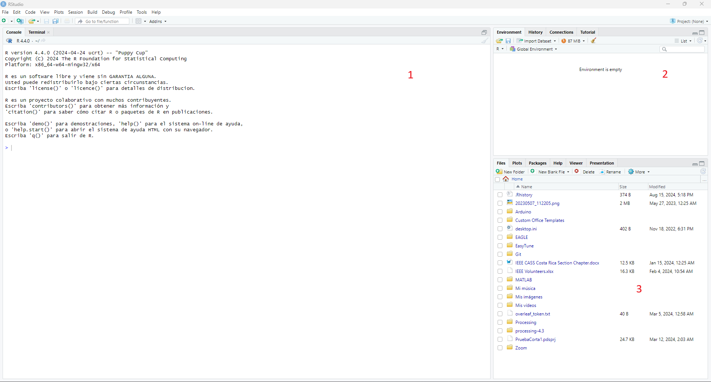
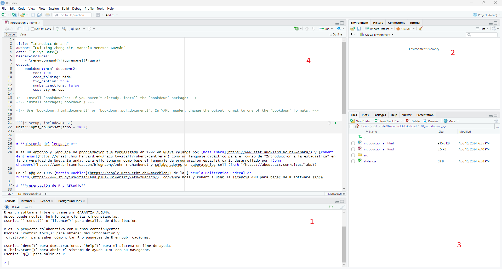
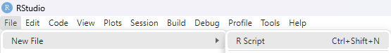

<!-- Install `bookdown`**: If you haven't already, install the `bookdown` package: -->
<!-- install.packages("bookdown") -->

<!-- Use `bookdown::html_document2` or `bookdown::pdf_document2`: In YAML header, change the output format to one of the `bookdown` formats: -->


```{r setup, include=FALSE}
knitr::opts_chunk$set(echo = TRUE)
```
# **Libro recomendado**
Se recomienda el libro [R para principiantes](https://bookdown.org/jboscomendoza/r-principiantes4/) de Juan Bosco Mendoza Vega, el cual explica mucho más a fondo el uso de R con ejemplos prácticos.


# **Historia del lenguaje R**

R es un entorno y lenguaje de programación fue formalizado en 1992 en Nueva Zelanda por [Ross Ihaka](https://www.stat.auckland.ac.nz/~ihaka/) y [Robert Gentleman](https://qfastr.hms.harvard.edu/faculty-staff/robert-gentleman) como un lenguaje didáctico para el curso de "Introducción a la estadística" en la Universidad de Nueva Zelanda, para ello tomaron como base el lenguaje de programación estadística S, desarrollado por [John Chambers](https://www.britannica.com/biography/John-T-Chambers) y colaboradores en Laboratorios Bell ([AT&T](https://about.att.com/sites/labs))

En el año de 1995 [Martin Mächler](https://people.math.ethz.ch/~maechler/) de la [Escuela Politécnica Federal de Zúrich](https://www.studyinswitzerland.plus/university/eth-zuerich/), convence Ross y Robert a usar la licencia GNU para hacer de R software libre.

# **Presentación de R y RStudio**

RStudio es un entorno de desarrollo integrado (IDE) para el lenguaje de programación R, dedicado a la computación estadística y gráficos. Incluye una consola, editor de sintaxis que apoya la ejecución de código, así como herramientas para el trazado, la depuración y la gestión del espacio de trabajo.

Podemos trabajar directamente en R pero RStudio facilita el interactuar con el lenguaje de programación y los procesos de carga de datos, instalación y administración de paquetes, exportación de gráficos y administración de archivos, entre otros.

R y RStudio son gratuitos y pueden obtenerse en las siguientes direcciones electrónicas [cran.r-project.org](cran.r-project.org), [www.rstudio.com](www.rstudio.com).

# **RStudio esta organizada normalmente en cuatro ventanas**

Cuando abrimos el programa por primera vez aparecen tres ventanas (Figura \@ref(fig:tres-ventanas)), la cuarta se refiere a un script ya existente que abrimos o que creamos nuevo (Figura \@ref(fig:cuatro-ventanas)).

```{r tres-ventanas, echo=FALSE, fig.cap="Las tres ventanas que se muestran al abrir RStudio", out.width = '100%'}

```

```{r cuatro-ventanas, echo=FALSE, fig.cap="Las tres ventanas que se muestran al abrir RStudio", out.width = '100%'}

```

## **Consola de comandos**

En ella aparecen, en primer lugar, una serie de mensajes con información sobre la versión de R que estamos ejecutando. Seguido aparece el prompt de R, que es el símbolo `>`, junto al que parpadea el cursor indicando que ese es el prompt activo, y que R está esperando una orden (ver la ventana 1 de la Figura \@ref(fig:cuatro-ventanas)).

Crear un nuevo script de trabajo que posteriormente debe guardar siguiendo la instrucción `File->New File->R script` (ver Figura \@ref(fig:crear-nuevo-script-r)) o con el atajo de teclado `Ctrl+Shift+N`.

```{r crear-nuevo-script-r, echo=FALSE, fig.cap="Las tres ventanas que se muestran al abrir RStudio", out.width = '60%'}

```

Empecemos haciendo el calculo de `3^2`. Asegúrese de que está situado en la línea del prompt de R. Si es necesario, haga clic con el mouse junto al símbolo `>`, y después teclé:

```{r}
2 + 2
```

```{r}
3^2
```

aparece la respuesta [1] 9 y justo debajo, aparece un nuevo prompt, que ahora pasa a ser el prompt activo. El uno entre corchetes es la forma en la que R nos indica que esta es la primera línea de su respuesta.


# **R como calculadora de operaciones básicas**

En R tenemos los siguientes operadores aritméticos:

| Operador |    Operación    | Ejemplo  | Resultado |
|:--------:|:---------------:|:--------:|:---------:|
|     +    |      Suma       | `3 + 2`  |    `5`    |
|     -    |      Resta      | `3 - 2`  |    `1`    |
|     *    | Multiplicación  | `3 * 2`  |    `6`    |
|     /    |    División     | `3 / 2`  |   `1.5`   |
|     ^    |    Potencia     | `3 ^ 2`  |    `9`    |
|    %%    | División entera | `3 %% 2` |    `1`    |

## **Suma**

```{r}
2 + 2
```

```{r}
3 + 4
```

## **Resta**

```{r}
5 - 1
```

## **Multiplicación, división y potencia**

```{r}
-5 * 2
```

```{r}
5 / 2
```

```{r}
5 ^ 2
```

# **Funciones integradas en R**

## **Raíz cuadrada**

```{r}
sqrt(25)
```

```{r}
25^(1 / 2)
```

```{r}
sqrt(26)
```

```{r}
25^(1 / 3)
```

## **Funciones trigonométricas**

```{r}
cos(pi)
```

```{r}
sin(pi)
```

```{r}
tan(pi)
```

```{r}
sin(3.14)
```

La notación que se usa en la respuesta es la forma típica de traducir la notación científica a los lenguajes de ordenador y calculadoras.

Para la función cotangente, se puede usar el inverso de la función `tan(x)` o con las funciones `sin(x)` y `cos(x)`.

```{r}
1 / tan(pi)
```

```{r}
cos(pi) / sin(pi)
```


## **Logaritmo en base 10**

```{r}
log10(50)
```

## **Logartimo natural (base `e`)**

```{r}
log(50)
```

## **Antilogaritmo natural / función exponencial**

```{r}
exp(5)
```

## **Uso prudente de los paréntesis**
Un uso prudente de paréntesis y espacios en las operaciones es una marca característica del buen hacer, cuando se escribe en código.

```{r}
1 / ((3 + 1) / 5)
```

```{r}
1 / (3 + 1) / 5
```

```{r}
2 * (4 + 6)
```

```{r}
2 * 4 + 6
```

# **Variables**
El operador `<-` es usado para asignaciones generales de valores de variables. Es buena práctica usar `<-` en lugar de `=`. El operador `=` también asigna el valor, pero se recomienda usarlo en llamadas de funciones para especificar los valores de los argumentos. Se verá un ejemplo más adelante.

## **Variables cuantitativas**
```{r}
a <- 2
b = 3
c <- a + b
c
```

```{r}
a <- b * c
a
```

```{r}
b <- (c - a)^2
b
```

```{r}
c <- a * b
```

```{r}
distancia <- 2
tiempo <- 3
velocidad <- distancia / tiempo
velocidad
```

## **Variables cualitativas**
Para su asignación se tratan como factores, estos van señalados entre comillas. Se refiere a variables de tipo "string" o cadena de caracteres alfanuméricos.

```{r}
# Cadenas alfanumericas, se escriben siempre entre comillas
pronostico <- "Leve"
pronostico
```

```{r}
n <- "bueno"
n
```

```{r}
nn <- "nn=$%&///malo"
nn
```

## **Secuencia de números**
Crea una secuencia numérica.
```{r}
1:10
```

Otra forma de generar la misma secuencia.
```{r}
seq(1, 15)
```

Crea una secuencia del 4 (inicio) al 10 (final) donde el 3er argumento es opcional y determina la distancia entre los números de la secuencia. Si no se lo incluye R usa el valor por defecto que es 1, es decir, hace una secuencia de 1 en 1.
```{r}
seq(4, 10, 2)
```

```{r}
seq(4, 10)
```

Secuencia del 0 al 1 que incrementa cada 0.1.
```{r}
seq(0, 1, 0.1)
```

## **Generar repeticiones con la funcion "rep"**

Repite 6 veces el caracter R.
```{r}
rep("R", 6)
```

Repite la secuencia del 1 a 5 tres veces.
```{r}
rep(1:5, 3)
```

Si se quiere que los elementos de una serie sean repetidos en lugar de la serie como un todo, entonces se debe escribir:
```{r}
rep(1:6, rep(3, 6))
```

Lo anterior es una serie del 1 al 6 donde se repite 3 veces los 6 elementos. Para una serie del 2 al 4 con 5 repeticiones de los 3 elementos:
```{r}
rep(2:4, rep(5, 3))
```

Cuando se quiere especificar la repetición de cada uno de los elementos específicamente, se puede crear una lista numérica que indique cuantas veces debe repetirse cada número (por ende, ambas deben ser del mismo tamaño). Por ejemplo, los elementos 4, 6, 2 y 7 se repiten 3, 2, 1 y 4 veces, respectivamente. La función "c" significa concatenar (combina varios elementos).
```{r}
rep(c(4, 6, 2, 7), c(3, 2, 1, 4))
```

# **Operaciones lógicas**

| Operador |      Comparación      | Ejemplo  | Resultado |
|:--------:|:---------------------:|:--------:|:---------:|
|    <     |       Menor que       | `3 < 2`  |  `FALSE`  |
|    <=    |   Menor o igual que   | `3 <= 2` |  `FALSE`  |
|    >     |       Mayor que       | `3 > 2`  |  `TRUE`   |
|    >=    |   Mayor o igual que   | `3 >= 2` |  `TRUE`   |
|    ==    | Exactamente igual que | `3 == 2` |  `FALSE`  |
|    !=    |    No es igual que    | `3 °= 2` |  `TRUE`   |

#s verdadero que 3 es menor que 6.
```{r}
3 < 6
```

Es falso que 3 sea mayor que 6
```{r}
3 > 6
```

Es falso que 3 sea igual a 6.
```{r}
3 == 6
```

Las operaciones lógicas también se pueden combinar:
```{r}
c(3 == 3, 2 < 4, 5 > 10)
```

# **Clases de objetos**

Ya nos dimos cuenta de que R tiene cinco clases atómicas de objetos:
- character (letras)
- numeric (números reales)
- integer (números enteros)
- complex (números complejos)
- logical (verdadero/falso o True/False)

Supongamos tenemos un número, el `2`, R verá este números como objeto numérico (número real). Existe una forma de decir explícitamente que se quieres un entero y es utilizando el sufijo `L` mayúscula, `2L`. ¡¡Has la prueba!!

También existe un número especial llamado `Inf` que representa infinito. `Inf` es como un número real, puede ser usado en cálculos.

Existe otro valor especial llamado `NAN` o `NaN` y representa un valor indefinido, así que puedes pensar en él como si no fuese un número.

## **Vectores**

Para crear un vector, los datos están separados por comas, y rodeados por paréntesis, con una letra `c` que precede al primer paréntesis. Esa letra `c` es el nombre de una función de R que significa concatenar.

```{r}
edades <- c(22, 21, 18, 19, 17, 21, 18, 20, 17, 18, 17, 22, 20, 19, 18)
```

Si se quiere ver el resultado de una asignación, se puede rodear toda línea con paréntesis
```{r}
(edades <- c(22, 21, 18, 19, 17, 21, 18, 20, 17, 18, 17, 22, 20, 19, 18))
```

```{r}
# Se llama a la variable edades
edades
```

¿Cómo incorporamos otras edades? Por ejemplo las edades 22, 18, 20, 21, 20.

```{r}
edades2 <- c(22, 18, 20, 21, 20)
# Usando la concatenacion de varaibles en otra varaible
edades3 <- c(edades, edades2)
edades3
```

Se puede referir a elementos del vector usando paréntesis rectos (indexar la lista o, simplemente, indexación).

```{r}
edades[5]
```

Accesar varios elementos al mismo tiempo.

```{r}
edades[c(1, 2, 6)]
```

Extraer los valores del vector que excluye el indice 5.

```{r}
edades
```

```{r}
edades[-5]
```

Extraer los valores de los índices del 6 al 9 del vector.

```{r}
edades[6:9]
```

Se pueden usar operadores lógicos para mostrar solo los elementos que cumplen lo requerido.

```{r}
edades > 20
```

Ahora, para mostrar los elemenos mayores que 20:

```{r}
edades[edades > 20]
```

Para mostrar los elemenos mayores que 22 (no hay ninguno):

```{r}
edades[edades > 22]
```

Para mostrar los elementos igual y que son mayores que 22:

```{r}
edades[edades >= 22]
```

¿En cuáles indices el valor de la operación lógica es igual a True?

```{r}
edades
```

```{r}
which(edades > 20)
```

Aplicar una operación (en este caso, una multiplicación) a cada elemento del vector.

```{r}
peso <- c(4.4, 5.3, 7.2, 5.2, 8.5, 7.3, 6.0, 10.4, 10.2, 6.1)
peso2 <- peso * 2
peso2
```


# **Indicadores estadísticos**

Calcular la media, desviación estandar y varianza del vector "peso".

```{r}
mean(peso)
```

```{r}
sd(peso)
```

```{r}
var(peso)
```

## **Calcular el Coeficiente de Correlación de Pearson**

```{r}
cor(peso2, peso)
```

## **Gráfico simple**

```{r}
plot(peso, peso2)
```

# **Aritmética de vectores**

```{r}
a <- peso
b <- peso2
a
```

```{r}
b
```

## **Suma**

```{r}
a + b
```

## **Resta**

```{r}
a - b
```

## **Multiplicación**

```{r}
a * b
```

## **División**

```{r}
a / b
```

# **Matrices**

## **Creación de una matriz**
```{r}
primera_matriz <- matrix(data = c(1, 8, 13, 12, 14, 11, 2, 7, 4),
                         nrow = 3, ncol = 3, byrow = TRUE)
primera_matriz
```

```{r}
matriz_por_filas <- matrix(data = c(1, 2, 3, 4, 5, 6, 7, 8, 9, 10, 11, 12),
                           nrow = 4, byrow = TRUE)
matriz_por_filas
```

```{r}
matriz_por_columnas <- matrix(data = c(1, 2, 3, 4, 5, 6, 7, 8, 9, 10, 11, 12),
                              nrow = 4, byrow = FALSE)
matriz_por_columnas
```

Podemos entonces construir matrices con diferentes instrucciones

```{r}
m <- matrix(c(1, 2, 3, 4, 5, 6, 7, 8, 9), nrow = 3, ncol = 3)
m
```

```{r}
m <- matrix(1:9, nrow = 3, ncol = 3)
m
```

```{r}
m <- matrix(1:9, nrow = 3)
m
```

```{r}
m <- matrix(1:9, ncol = 3)
m
```

Extraer el valor de la fila 2, columna 1

```{r}
m[2, 1]
```

Extraer fila 2

```{r}
m[2, ]
```

Extraer columnas 1 y 3

```{r}
m[, c(1, 3)]
```

Eliminar la variable `m` de memoria

```{r}
rm(m)
# Descomentar para ver el error, ya que no existe en memoria
#m
```

Creamos dos matrices

```{r}
m1 <- matrix(c(1, 4, 5, 7, 5, 4, 3, 4, 9), nrow = 3)
m1
```

```{r}
m2 <- matrix(c(8, 4, 0, 7, 0, -3, -1, 5, 9), nrow = 3)
m2
```

## **Suma**

```{r}
m1 + m2
```

## **Resta**

```{r}
m1 - m2
```

## **Multiplicación (elemento por elemento)**

```{r}
m1 * m2
```

## **Multiplicación matricial**

```{r}
m1 %*% m2
```

## **Transpuesta**

```{r}
m1
```

```{r}
t(m1)
```

## **Inversa de una matriz**

```{r}
solve(m1)
```

## **Calcular la media de las columnas de m1**

- "apply": Devuelve un vector o matriz o lista de valores obtenidos al aplicar una función a los márgenes de una matriz.

```{r}
m1
```

```{r}
# El 2 significa segunda dimension (calculo por columna)
apply(m1, 2, mean)
```

```{r}
# El 1 significa primera dimension (calculo por fila)
apply(m1, 1, mean)
```

## **Calcular la suma de las columnas de m2**

```{r}
m2
```

```{r}
apply(m2, 2, sum)
```

## **Calcular las suma de las filas de m2**

```{r}
m2
```

```{r}
apply(m2, 1, sum)
```

# **Listas**

Una lista es un contenedor de objetos que pueden ser de cualquier clase: números, vectores, matrices, funciones, data.frames, incluso otras listas. Una lista puede contener a la vez varios de estos objetos, que pueden ser además de distintas dimensiones.

```{r}
l <- list(a = 1:3, b = c("cat1", "cat2", "cat3"),
          c = matrix(1:9, nrow = 3),
          d = list(a1 = c(5, 6, 7, 8, 10),
                   b1 = c("a", "b", "c")))
l
```

## **Extraer el valor del ítem `a` de la lista**

```{r}
l$a
```

```{r}
l[[1]]
```

```{r}
l[["a"]]
```

## **Extraer el valor del ítem `c` de la lista**

```{r}
l$c
```

```{r}
l[[3]]
```

```{r}
l[["c"]]
```

## **Extraer el valor del ítem `d` de la lista**

```{r}
l$d
```

## **¿Qué quiero estraer?**

```{r}
l$d[[1]]
```

```{r}
l$d$a1[[1]]
```

```{r}
l$d[[2]]
```

## **Usando `lapply` para determinar la media de los valores numéricos de dos objetos de una lista**

```{r}
l2 <- list(edades = c(23, 45, 64, 33, 54, 73, 32, 28, 12),
           pesos = c(70, 80, 50, 65, 52, 50, 65, 70, 50))
l2
```

```{r}
lapply(l2, mean)
```

# **Data Frames**

El término "data frame" se traduce como Hoja de datos o Marco de datos.

Los dataframes son una clase de objetos especial que se utilizan cuando se realiza un estudio estadístico sobre los sujetos u objetos de una muestra, los datos se organizan de tal forma que cada fila corresponde a un sujeto y cada columna a una variable.

La estructura de un `data.frame` es muy similar a la de una matriz. La diferencia es que una matriz solo admite valores numéricos, mientras que en un `data.frame` podemos incluir también datos alfanuméricos y sus columnas estan nombradas.

Si comparamos un `data.frame` a una lista, notamos que son diferentes porque en un `data.frame` todos los objetos tienen la misma cantidad de elementos, pero mantienen la libertad de pertenecer a distintas clases.

```{r}
d <- data.frame(enteros = 1:10, decimales = seq(.1, 1, by = .1))
d
```

Nótese que estos son dos vectores de clases diferentes:

```{r}
# La funcion head devuelve los primeros elementos
head(d)
```

```{r}
class(d)
```

```{r}
class(d$enteros)
```

```{r}
class(d$decimales)
```

# **Creación de una Variable de Tipo Factor**

Un `factor` es una estructura de datos para manejar variables categóricas (poseen número finito de valores o niveles). En R los factores se utilizan habitualmente para realizar clasificaciones de los datos, estableciendo su pertenencia a los grupos o categorías determinados por los niveles del factor. Necesitamos tener un objeto en R para eso. Los factores permiten trabajar con modelos y gráficas de variables categóricas. Por eso son importantes.

Ejemplos pueden ser rangos de edades, colores, o días de la semana.

```{r}
colores <- factor(x = c("azul", "rojo", "amarillo", "negro", "verde"))
colores
```

```{r}
colores <- factor(x = c("azul", "rojo", "amarillo", "negro", "verde"),
                  ordered = TRUE)
colores
```

```{r}
estado_civil <- factor(x = c("soltero", "casado", "no contesta"),
                       levels = c("casado", "viudo", "soltero", "union libre"))

estado_civil
```

## **Creación de una variable de tipo factor ordinal**

```{r}
grado_academico <- factor(x = c("primaria", "doctorado", "secundaria"),
                          levels = c("primaria", "secundaria", "preparatoria",
                                     "bachillerato", "licenciatura", "maestría",
                                     "doctorado"),
                          ordered = TRUE)
grado_academico
```

```{r}
grupo_ordenado <- factor(x = c("malo", "malo", "regular", "bueno", "muy bueno",
                               "excelente"),
                         levels = c("muy malo", "malo", "regular", "bueno",
                                    "muy bueno", "excelente"),
                         ordered = TRUE)
grupo_ordenado
```

```{r}
grupo_no_ordenado <- factor(x = c("malo", "malo", "regular", "bueno",
                                  "muy bueno", "excelente"))
grupo_no_ordenado
```

```{r}
min(grupo_ordenado)
```

```{r}
max(grupo_ordenado)
```

Produce error determinar min y max de grupo no ordenado

```{r}
# Descomentar para ver los errores
#min(grupo_no_ordenado)
#max(grupo_no_ordenado)
```

Volvamos a la creación de una data.frame con la ayuda de estructuras factor

```{r}
ojos <- factor(c("Azules", "Marrones", "Marrones"),
               levels = c("Azules", "Marrones", "Verdes", "Negros"))

datos <- data.frame(Color.ojos = ojos,
                    Peso = c(68, 75, 88),
                    Altura = c(1.65, 1.79, 1.85))
datos
```

Use `str()` para visualizar de forma compacta la estructura interna de un objeto R, una función de diagnóstico y una alternativa al resumen.

```{r}
str(datos)
```

```{r}
dim(datos)
```

## **Convertir matrices en `data.frame`**

```{r}
matriz <- matrix(data = c(1, 5, 9, 2, 6, 0, 3, 7, 0, 4, 8, -1),
                 nrow = 4,
                 byrow = TRUE)
matriz
```

```{r}
nuevos_datos <- as.data.frame(matriz)
nuevos_datos
```

# **Lectura de un `data.frame` a partir de un archivo CSV**

Un CSV (comma-separated values) es un archivo de texto que almacena los datos en forma de columnas, separadas por coma y las filas se distinguen por saltos de línea. Este tipo de archivo es creado en Excel.

Se puede abrir el archivo en el bloc de notas comprobando que nos es más que un archivo de texto donde las columnas están separadas por ";" o "," (en este caso) y los cambios de fila por salto de línea.

Debemos establecer el directorio donde se encuentra el archivo a leer como directorio de trabajo.

```{r}
# Buscamos el directorio de trabajo
#getwd()
# Cambiar por su directorio actual de trabajo
#setwd("~/EIPI/cursos/R/01_introduccion_a_r")
#setwd("C:/Users/.....")
```

```{r}
datos_estudiantes <- read.csv("EjemploEstudiantes.csv",
                              header = TRUE,
                              sep = ";",
                              dec = ",",
                              row.names = 1)
datos_estudiantes
```

```{r}
summary(datos_estudiantes)
```

```{r}
dim(datos_estudiantes)
```

```{r}
str(datos_estudiantes)
```

Todas la columnas de la fila 1.

```{r}
datos_estudiantes[1, ]
```

Todas las filas de la columna 2.

```{r}
datos_estudiantes[, 2]
```

Los estudiantes con notas en ciencias superiores a 8.

```{r}
# Filtro / condicion de filtrado
buenos_ciencias <- datos_estudiantes[, 2] >= 8
# Obtener los datos que coinciden con la condicion
datos_estudiantes[buenos_ciencias, ]
```

```{r}
datos_estudiantes$Matematica
```

```{r}
datos_estudiantes$Ciencias
```

Hasta ahora hemos creado muchas variables y matrices y podemos solicitar un listado de los objetos creados en la sesión.

```{r}
ls()
```

```{r}
objects()
```

Para remover un objeto que hemos creado se usa la funcion `rm`.

```{r}
# Borrar el objeto "l"
rm(l)
ls()
```

```{r}
# Ya no encuentra este objeto porque fue borrado
#l
```

# **Ayuda en R**

- *Para pedir ayuda:* signo de interrogación `?` seguido por el nombre de la función. También usando la funcion `help()`.

```{r}
# L forma mas comun de buscar ayuda
#?rm
```

Lo primero que se indica es el paquete donde se encuentra la función. En el caso anterior, `rm` esta en el paquete básico (`base`) cuando se instala R, por lo que no necesitariamos instalar ningún paquete para usar esta función.

Con las funciones especificadas por caracteres especiales, el argumento deber ir entre comillas, para transformarlo en una "cadena de caracteres" `help("[[")`

```{r}
#?data.frame
#?round
# Alternativamente se puede usar la funcion "help"
#help(t.test)
```

En el caso de la funcion `t.test` se encuentra en el paquete "stats" que ya esta incorporado al programa R que se instala.

```{r}
#help(rnorm)
# Despliega los recursos disponibles en R
#help.start()
```

Se pueden obtener ejemplos de las funciones de R.

```{r}
example(seq)
```

```{r}
example(round)
```

```{r}
example(mean)
```

# **Paquetes**

Cuando instalamos R, instala la base de R. Muchas de las funcionalidades adicional están en paquetes (conjunto de funciones y datos documentados) que la comunidad contribuye.

Desde Rstudio podemos instalar paquetes (`Tools - > Install packages` o usar la función `install.packages("nombre_paquete")`). Una vez instalados, podemos cargarlos a nuestra sesión de R mediante library.

El uso de `library(help=)` proporciona informacion sobre paquetes de R.

```{r}
# Para ecologia de comunidades, ej. indices diversidad
#library(help=vegan)
#library(help=MASS)
#library(help=lattice)
```

Para cargar un paquete, por ejemplo `vegan` se usa comunmente `library` o también la funcion `require`.

```{r}
#library(vegan)
#?library
#require(MASS)
```

```{r}
# La funcion "adonis" se encuentra en el paquete "vegan"
#?adonis
```

Si no cargamos previamente el paquete donde esta la función de interés no tendremos ayuda y dará mensaje de error al tratar de usarla.

```{r}
#?lmer
```

```{r}
#libray(lmer)
# esta funcion esta en el paquete lme4 que cargamos previamente
#?lmer
```

# **Base de datos de R**

R cuenta con una serie de bases de datos de ejemplos, podemos ver algunos de los nombres de esta base de datos en:

```{r}
library(help = "datasets")
```

Estas pueden llamarse con `data(nombre de la base de datos)`

```{r}
data(mammals)
```

```{r}
#?mammals
```

En este caso: Pesos cerebrales y corporales para 62 especies de mamíferos terrestres.

```{r}
#mammals
#install.packages("MASS")
library(MASS)
#View(mammals)
```

Si se llama a la variable `brain` nos da error.

Si no se quiere usar el nombre del objeto cada vez que se quiere identificar una variable se puede usar las funciones `attach`, `detach`.

```{r}
attach(mammals)
plot(body, brain)
detach(mammals)
```
